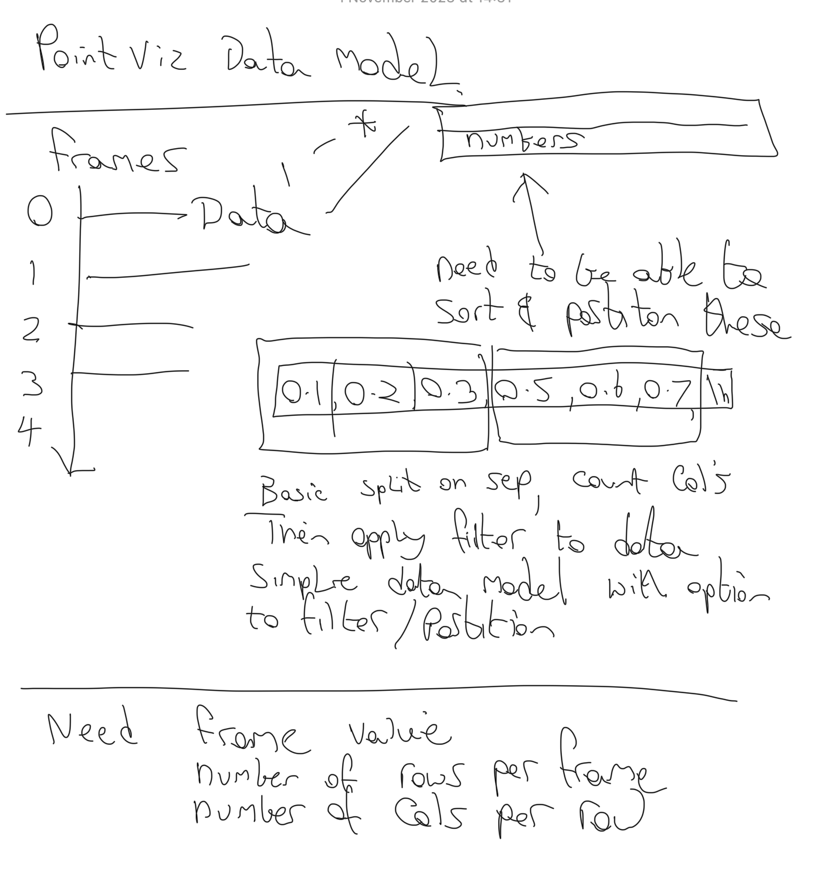

# Design Documents

## DataModel



The reader class will generate a data model (with it's own seraialisation) that will be passed to the renderer. 

At it's lowest level the data model will be a vector of Frame objects. Each frame will contain a vector of data values which can basically be any numeric type however I guess these should just be float or int. 

Data can be re-ordered and grouped (could be good to pin data too but that is later). 

```cpp
struct Frame
{
    std::variant<int,float,double> m_actualFrameTime;
    std::vector<std::vector<std::variant<int,float,double>>> m_frameData;
};
```

This give us quite a flexible design for storing anything, we can use the std::variant::index method to see what the data is (or what is actually being stored).

This data model is not going to be high performance, we can use a filter later to build something more efficient (for opengl etc). This can be done by using a std::vector of explicit types later, and either moving the data to an SOA type format for easier OpenGL usage etc. 

```mermaid
class Frame{
        # m_actualFrameTime : std::variant<int,float,double> 
        # m_frameData : std::vector<std::vector<std::variant<int,float,double>>>
    }
```